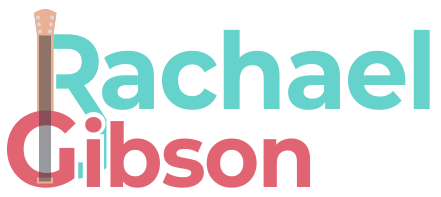

<a id="readme-top"></a>


<!-- PROJECT SHIELDS -->
<!--
*** I'm using markdown "reference style" links for readability.
*** Reference links are enclosed in brackets [ ] instead of parentheses ( ).
*** See the bottom of this document for the declaration of the reference variables
*** for contributors-url, forks-url, etc. This is an optional, concise syntax you may use.
*** https://www.markdownguide.org/basic-syntax/#reference-style-links
-->
[![Forks][forks-shield]][forks-url]
[![Stargazers][stars-shield]][stars-url]
[![Issues][issues-shield]][issues-url]
[![LinkedIn][linkedin-shield]][linkedin-url]


<!-- PROJECT LOGO -->
<br />
<div align="center">
  <a href="https://github.com/tabitha-r/rgibsonmusic">
    
  </a>

<h3 align="center">R Gibson Music</h3>

  <p align="center">
    A portfolio site for guitarist, composer, sound artist, and audio editor Rachael Gibson
    <br />
    <a href="https://github.com/tabitha-r/rgibsonmusic"><strong>Explore the docs »</strong></a>
    <br />
    <br />
    <a href="https://www.tabithariley.co.uk/rgibsonmusic/">View Demo</a>
    ·
    <a href="https://github.com/tabitha-r/rgibsonmusic/issues/new?labels=bug&template=bug-report---.md">Report Bug</a>
    ·
    <a href="https://github.com/tabitha-r/rgibsonmusic/issues/new?labels=enhancement&template=feature-request---.md">Request Feature</a>
  </p>
</div>


<!-- TABLE OF CONTENTS -->
<details>
  <summary>Table of Contents</summary>
  <ol>
    <li>
      <a href="#about-the-project">About The Project</a>
      <ul>
        <li><a href="#built-with">Built With</a></li>
      </ul>
    </li>
    <li><a href="#updating">Updating</a></li>
      <ul>
        <li><a href="#updating-contact">Updating Contact Information</a></li>
        <li><a href="#updating-social">Updating Social Media Accounts</a></li>
        <li><a href="#updating-latest">Updating Latest Events</a></li>
        <li><a href="#updating-cv">Updating CV</a>
            <ul>
                <li><a href="#updating-works">Updating CV Works</a>
            </ul></li>
      </ul>
    <li><a href="#contact">Contact</a></li>
    <li><a href="#acknowledgments">Acknowledgments</a></li>
  </ol>
</details>


<!-- ABOUT THE PROJECT -->
## About The Site

[![RGibsonMusic Screen Shot][product-screenshot]](https://www.tabithariley.co.uk/rgibsonmusic/)

This is the new portfolio site for [Rachael Gibson](https://www.rgibsonmusic.co.uk/). It includes an 'About' and 'CV' page, the latter of which is specifically styled for easy printing. Alongside these, there are pages to list and explore both 'Projects' and 'Compositions'.

Including features:

* SVG Logos
* Fully mobile responsive
* Keyframe Animations that abide by `prefers-reduced-motion`
* Printer-friendly styling for printing
* Toggleable light and dark themes which can detect an existing preference
* JSON-based updateable data storage
* Soundcloud, YouTube, and Vimeo embeds

<p align="right">(<a href="#readme-top">back to top</a>)</p>


### Built With

* [![Hugo][Hugo]][Hugo-url]
* [![Sass][Sass]][Sass-url]
* [![TypeScript][TypeScript]][TypeScript-url]
* [![FontAwesome][FontAwesome]][FontAwesome-url]

<p align="right">(<a href="#readme-top">back to top</a>)</p>


<!-- UPDATING EXAMPLES -->
## Updating

Basic information like contact details, social media accounts, CV points, and upcoming events can be easily updated using the relevant `.json` files in the `assets/data` directory. 

JSON files are set up as a collection of `"key": "value"` pairs. Be careful, unless the value is a number or true or false, they will need quotation marks around them. For example `"year": 2024` is fine, as is `"show": true`, but `"title": "Feedback Piano"` require the quotes. Also make sure to leave all the curly brackets (`{ }`) and commas in place.

1. To edit any of these, first navigate to [the directory](/tree/main/assets/data)

### Updating Contact

To update contact information for the CV and contact pages, edit the `contact.json` file.

2. From the `assets/data` directory, click `contact.json`
3. In the top right, click the pencil icon to edit the file
4. Update the relevant field with new information.
    ```json
    {
        "contact": {
            "email": "new@email.here",
            "phone": "+44 (0) 098 765 4321"
        }
    }
    ```
5. Click the green 'Commit Changes' button in the top right.
6. Wait for the website to re-deploy

### Updating Social

To update social media accounts for the footer, edit the `socials.json` file. The most popular social media platforms should automatically get the correct icon, otherwise it will need to be added by Tabitha.

2. From the `assets/data` directory, click `socials.json`
3. In the top right, click the pencil icon to edit the file
4. Copy the JSON below (including the comma at the beginning)
    ```json
    ,
    {
            "platform": "",
            "platform_descriptor": "",
            "link": "",
            "link_descriptor": "Rachael Gibson on ",
            "weight": 
    }
    ```
5. Paste it after the last entry's `}`, before the last `] }`
    ```json
    ...
            "link_descriptor": "Rachael Gibson on Soundcloud",
                "weight": 20
            }->PASTE HERE<-
        ]
    }
    ```
6. Begin to fill in the fields. The `"platform"` field should have no spaces, doesn't need any capitals, and will be used to get the icon from [FontAwesome](https://fontawesome.com/search?f=brands&o=r). The `"platform_descriptor"` can be a grammatically correct version of the platform name.
    ```json
    "platform": "facebook",
    "platform_descriptor": "Facebook",
    ```
7. The `"link"` field should be the URL to the account, and the `"link_descriptor"` field likely will follow the format of `"Rachael Gibson on [platform]"`
    ```json
    "link": "https://www.facebook.com/exampleuser/",
    "link_descriptor": "Rachael Gibson on Facebook",
    ```
8. The `"weight"` field is the order the icons will appear. The lower the weight, the earlier the link will appear in the list and the higher, the later. In general, just +10 to the last weight unless you want to give this link more prominence.
    ```json
    "weight": 30
    ```
9. Click the green 'Commit Changes' button in the top right.
10. Wait for the website to re-deploy

### Updating Latest

This controls the 'Coming Up' section on the homepage. This can be used to advertise upcoming concerts, events, releases etc.

2. From the `assets/data` directory, click `latest.json`
3. In the top right, click the pencil icon to edit the file
4. Copy the JSON below (including the comma at the beginning)
    ```json
    ,
    {
            "show": true,
            "title": "",
            "description": "",
            "date": "",
            "time": "",
            "location": "",
            "location_google_url": "",
            "link": "",
            "link_label": ""
    }
    ```
5. Paste it after the last entry's `}`, before the last `] }`
    ```json
    ...
            "location": "O2 Academy, Liverpool",
            "link": "https://www.tabithariley.co.uk/"
            }->PASTE HERE<-
        ]
    }
    ```
6. Begin to fill in the fields. The `"show"` field determines whether it is shown on the website, this means you can hide something that's already happened or keep a draft hidden. This can be `true` or `false` and doesn't need quotation marks. This is a required field.
    ```json
    "show": true,
    ```
7. The `"title"` and `"description"` fields are fairly self explanatory: what is the event? These fields are required.
    ```json
    "title": "New Composition Release",
    "description": "Rachael will be releasing her latest composition on her social media as well as in person at this Event.",
    ```
8. The `"date"` and `"time"` fields are the date and time of the events. These are optional fields if it is not an event at a specific time, and you can have one without the other. The `"date"` field should be in the format of 'dd mmm yy', for example: '24 Aug 24'. The `"time"` can be whatever format you like.
    ```json
    "date": "19 Jan 25",
    "time": "1:00pm",
    ```
9. The `"location"` and `"location_google_url"` fields present the event location. Again, these are optional if it is not at a physical location, and you can have location without the Google URL but you cannot have the Google URL without the location. `"location"` is the name of the venue, and `"location_google_url"` can be used to link to the venue on Google Maps (Find the venue on Google Maps, and then click 'share' and copy the URL).
    ```json
    "location": "Lime Street Station, Liverpool",
    "location_google_url": "https://maps.app.goo.gl/bUwaYQHpa7HHH2vp7",
    ```
10. The `"link"` and `"link_label"` fields are very versatile. These are the link buttons. If there is more information on a different website, or a place to buy tickets etc., you can use these fields. If a `"link"` is provided but no `"link_label"` the button will default to 'Learn More'. You can also use Emojis in the label!
    ```json
    "link": "https://www.seaty.co.uk/",
    "link_label": "Book Your Place!"
    ```
11. Click the green 'Commit Changes' button in the top right.
12. Wait for the website to re-deploy

### Updating CV

Updating the CV is a little more complex than the previous JSON files, just because the JSON file is bigger.

2. From the `assets/data` directory, click `cv.json`
3. In the top right, click the pencil icon to edit the file
4. This JSON file is split into four arrays (lists).
    ```json
    {
        "works": [
            ...
        ],
        "residencies": [
            ...
        ],
        "education": [
            ...
        ],
        "employment": [
            ...
        ]
    }
    ```

#### Updating Works

5. Find the `"works"` section of the JSON file.
6. Copy the following JSON (including the comma at the beginning)
    ```json
    ,
    {
            "title": "",
            "year": 2024,
            "description": "",
            "show": true
    }
    ```
7. Paste it after the last entry's `}`, before the last `] }`
    ```json
    ...
        "description": "",
        "show": true
        }->PASTE HERE<->
    ],
    "residencies": [
    ...
    ```
8. Fill in the fields, they are all fairly self-explanatory. `"year"` and `"show"` do not need quotation marks, while `"title"` and `"description"` do.
    ```json
    {
            "title": "My Next Amazing Composition",
            "year": 2025,
            "description": "for ukulele",
            "show": true
    }
    ```
9. Click the green 'Commit Changes' button in the top right.
10. Wait for the website to re-deploy

#### Updating Residencies

5. Find the `"residencies"` section of the JSON file.
6. Copy the following JSON (including the comma at the beginning)
    ```json
    ,
        {
            "programme": "",
            "year": 2024,
            "role": "Participant",
            "additional_info": "",
            "show": false
        }
    ```
7. Paste it after the last entry's `}`, before the last `] }`
    ```json
    ...
        "additional_info": "",
        "show": true
        }->PASTE HERE<->
    ],
    "education": [
    ...
    ```
8. Begin to fill in the fields. `"programme"` is the name of the residency/workshop/programme.
    ```json
    "programme": "Ukuleleists United 2024/2025",
    ```
9. The `"year"` field is versatile. If it is a single year, then quotation marks aren't needed. However, if it is over multiple years, this can be written with a hypen or slash and wrapped in quotation marks.
    ```json
    "year": 2025,
        OR
    "year": "2024/2025",
    ```
10. The `"role"` field is filled in with 'Participant' by default but this can be changed to whatever role required.
    ```json
    "role": "Workshop Leader",
    ```
11. The `"additional_info"` field can be used for whatever additional sentence(s) you want to add. These will only be shown as a plain sentence so try to keep it simple.
    ```json
    "additional_info": "Part of the Edinburgh Fringe Festival"
    ```
12. Click the green 'Commit Changes' button in the top right.
13. Wait for the website to re-deploy

#### Updating Education

5. Find the `"education"` section of the JSON file.
6. Copy the following JSON (including the comma at the beginning)
    ```json
    ,
        {
            "institution": "",
            "course_name": "",
            "start_date": "",
            "end_date": "",
            "grade": "",
            "current": false,
            "modules": [],
            "additional_info": "",
            "show": true
        }
    ```
7. Paste it after the last entry's `}`, before the last `] }`
    ```json
    ...
            "additional_info": "",
            "show": false
        }->PASTE HERE<-
    ],
    "employment": [
    ...
    ```
8. Begin to fill in the fields. The `"institution"` is the university, school, or provider of the course, which is thr `"course_name"` field. 
    ```json
    "institution": "Liverpool Institute of Performing Arts",
    "course_name": "MA Actor Musicianship",
    ```
9. The `"start_date"` and `"end_date"` are for the beginning and end of the course. These should be wrapped in quotations and can be the date, such as 'September 2007' or just '2007', or a word like 'present' or 'ongoing'.
    ```json
    "start_date": "September 2021",
    "end_date": "July 2022",
        OR
    "start_date": "2023",
    "end_date": "present",
    ```
10. The `"grade"` field can be left empty if the course is ongoing, or include the received grade.
    ```json
    "grade": "Distinction"
    ```
11. The `"current"` field indicates whether the course is ongoing. If it is finished, `"current"` will be `false`. If it is still ongoing, it will be `true`.
    ```json
    "current": true
        OR
    "current": false
    ```
12. The `"modules"` field is a little more complicated. Between the square brackets `[ ]` you can include as many words/sentences/phrases as you like separated by commas. These can be on one line or split up onto new lines. This can also be left as empty brackets `[]`.
    ```json
    "modules": ["composition", "interactive music systems", "studio practice", "thesis"],
        OR
    "modules": [
        "MUSI130 – Introduction to Classical Music History",
        "MUSI108 – Introduction to Sound Recording and Production",
        "MUSI170 – Introduction to Music and AV media",
        "MUSI213 – Sampling and Remixing",
        "MUSI380 – Exploring Rhythm, Form and Musical Time"
    ],
        OR
    "modules": [],
    ```
13. The `"additional_info"` field can be used for whatever additional sentence(s) you want to add. These will only be shown as a plain sentence so try to keep it simple. It can be left blank.
    ```json
    "additional_info": "Funded by WBL Inc."
    ```
14. The `"show"` field controls whether this information is displayed.
    ```json
    "show": true
        OR
    "show": false
    ```
15. Click the green 'Commit Changes' button in the top right.
16. Wait for the website to re-deploy

#### Updating Employment

5. Find the `"employment"` section of the JSON file.
6. Copy the following JSON (including the comma at the beginning)
    ```json
    ,
        {
            "role": "",
            "employer": "",
            "start_date": "",
            "end_date": "",
            "additional_info": "",
            "modules": [],
            "responsibilities": [],
            "show": false
        }
    ```
7. Paste it after the last entry's `}`, before the last `] }`
    ```json
    ...
                "responsibilities": [],
                "show": false
            }->PASTE HERE<-
        ]
    }
    ```
8. Begin to fill in the fields. `"role"` is the job title, and `"employer"` is the person or company the employment was with.
    ```json
    "role": "Composer",
    "employer": "Tabitha Riley",
    ```
9. The `"start_date"` and `"end_date"` are for the beginning and end of the employment. These should be wrapped in quotations and can be the date, such as 'September 2007' or just '2007', or a word like 'present' or 'ongoing'.
    ```json
    "start_date": "September 2021",
    "end_date": "July 2022",
        OR
    "start_date": "2023",
    "end_date": "present",
    ```
10. The `"additional_info"` field can be used for whatever additional sentence(s) you want to add. These will only be shown as a plain sentence so try to keep it simple. It can be left blank.
    ```json
    "additional_info": "Credits include original compositions for a stageplay",
    ```
11. The `"modules"` field is a little more complicated. Between the square brackets `[ ]` you can include as many words/sentences/phrases as you like separated by commas. These can be on one line or split up onto new lines. This can also be left as empty brackets `[]`.
    ```json
    "modules": ["composition", "interactive music systems", "studio practice", "thesis"],
        OR
    "modules": [
        "MUSI130 – Introduction to Classical Music History",
        "MUSI108 – Introduction to Sound Recording and Production",
        "MUSI170 – Introduction to Music and AV media",
        "MUSI213 – Sampling and Remixing",
        "MUSI380 – Exploring Rhythm, Form and Musical Time"
    ],
        OR
    "modules": [],
    ```
12. The `"responsibilites"` field is the same format as the `"modules"` field to list specific responsibilities in this employment.
    ```json
    "responsibilities": [ "Creation of original sound design elements", "audio editing", "clean-up" ],
        OR
    "responsibilities": [],
    ```
13. The `"show"` field controls whether this information is displayed.
    ```json
    "show": true
        OR
    "show": false
    ```
14. Click the green 'Commit Changes' button in the top right.
15. Wait for the website to re-deploy

<p align="right">(<a href="#readme-top">back to top</a>)</p>


<!-- CONTACT -->
## Contact

Tabitha Riley - contact@tabithariley.co.uk

Rachael Gibson - contact@rgibsonmusic.co.uk

Project Link: [https://github.com/tabitha-r/rgibsonmusic](https://github.com/tabitha-r/rgibsonmusic)

<p align="right">(<a href="#readme-top">back to top</a>)</p>


<!-- ACKNOWLEDGMENTS -->
## Acknowledgments

* [Normalize](https://necolas.github.io/normalize.css/)
* [FontAwesome](https://fontawesome.com/)
* [Bunny Fonts](https://fonts.bunny.net/)
* [GitHub Pages](https://pages.github.com/)

<p align="right">(<a href="#readme-top">back to top</a>)</p>


<!-- MARKDOWN LINKS & IMAGES -->
<!-- https://www.markdownguide.org/basic-syntax/#reference-style-links -->
[forks-shield]: https://img.shields.io/github/forks/tabitha-r/rgibsonmusic.svg?style=for-the-badge
[forks-url]: https://github.com/tabitha-r/rgibsonmusic/network/members
[stars-shield]: https://img.shields.io/github/stars/tabitha-r/rgibsonmusic.svg?style=for-the-badge
[stars-url]: https://github.com/tabitha-r/rgibsonmusic/stargazers
[issues-shield]: https://img.shields.io/github/issues/tabitha-r/rgibsonmusic.svg?style=for-the-badge
[issues-url]: https://github.com/tabitha-r/rgibsonmusic/issues

[linkedin-shield]: https://img.shields.io/badge/-LinkedIn-black.svg?style=for-the-badge&logo=linkedin&colorB=555
[linkedin-url]: https://linkedin.com/in/tabitha-r

[product-screenshot]: assets/images/screenshot.webp

[Hugo]: https://img.shields.io/badge/Hugo-FF4088?style=for-the-badge&logo=hugo&logoColor=white
[Hugo-url]: https://gohugo.io/ 
[Sass]: https://img.shields.io/badge/Sass-CC6699?style=for-the-badge&logo=sass&logoColor=white
[Sass-url]: https://sass-lang.com/
[TypeScript]: https://img.shields.io/badge/TypeScript-3178C6?style=for-the-badge&logo=typescript&logoColor=white
[TypeScript-url]: https://www.typescriptlang.org/
[FontAwesome]: https://img.shields.io/badge/FontAwesome-538DD7?style=for-the-badge&logo=fontawesome&logoColor=white
[FontAwesome-url]: https://fontawesome.com/
